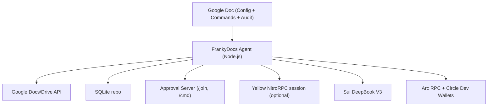

# FrankyDocs (DocWallet)

**HackMoney 2026** — Yellow · Arc · Sui DeepBook · ENS

> Turn any Google Doc into a multi-chain DeFi treasury. Proposers need no wallet; approvers sign once via Yellow delegated keys (gasless). The autonomous agent monitors prices, executes stop-losses, sweeps yield, and rebalances capital across Arc and Sui.

Note: the codebase uses the internal name "DocWallet" in env vars, database schema, and template anchors (for example `DOCWALLET_*` and `docwallet.policy`).

## 🌟 Prize Track Alignment

### Yellow Network ($15K) — State Channel Integration
- **NitroRPC/0.4 protocol** — real WebSocket + HTTP transport with ECDSA signing
- **Delegated session keys** — signers authorize once via EIP-712, then approve commands gaslessly
- **Off-chain USDC payments** — `DW YELLOW_SEND 5 USDC TO 0x...` redistributes allocations without gas
- **Session lifecycle** — `SESSION_CREATE` → off-chain operations → `SESSION_CLOSE` (on-chain settlement)
- **Gasless approvals** — every command approval is recorded via `submit_app_state` instead of on-chain tx

### Arc + Circle ($10K) — Cross-Chain Treasury
- **Arc L1 testnet** (chain ID 5042002) — all treasury operations execute on Arc
- **Circle Developer-Controlled Wallets SDK v2** — creates wallets, resolves USDC token UUIDs, executes transactions
- **CCTP Bridge** — `DW BRIDGE 100 USDC FROM arc TO sui` with Circle cross-chain routing
- **Unified Treasury** — `DW TREASURY` shows combined balances across Sui, Arc, and Yellow with USD valuation
- **Cross-chain Rebalance** — `DW REBALANCE 100 FROM arc TO sui` moves capital between all 3 chains
- **Autonomous agent** — monitors balances, detects idle capital, auto-proposes `SWEEP_YIELD` and `REBALANCE`
- **Multi-recipient payouts** — `DW PAYOUT_SPLIT` distributes USDC to multiple addresses in one flow

### Sui / DeepBook V3 ($10K) — CLOB Trading
- **Official `@mysten/deepbook-v3` SDK** with Programmable Transaction Blocks
- **Full order lifecycle** — limit orders, market orders (IOC), cancel, settle, deposit, withdraw
- **BalanceManager** — on-chain shared balance for capital-efficient trading
- **Price Oracle** — live SUI/USDC from DeepBook orderbook L2 data
- **Conditional orders** — stop-loss & take-profit auto-trigger from price ticks
- **P&L tracking** — trade history with running profit/loss calculations

### ENS ($5K) — Policy Governance
- **On-chain spend limits** via ENS text records (`docwallet.policy`)
- **Fine-grained controls** — `maxNotionalUsdc`, `dailyLimitUsdc`, `allowedPairs`, `payoutAllowlist`
- **Scheduling rules** — `schedulingAllowed`, `maxScheduleIntervalHours`
- **Bridge controls** — `bridgeAllowed`, `allowedChains`

## What it does
- Watches a Google Doc for commands in a Commands table
- Parses `DW ...` commands and enforces policy from ENS text records
- Collects approvals via a local web server and signer registry
- Auto-proposes missing setup steps, protective stop-losses, and yield sweeps
- Shows approval progress and gasless impact metrics
- Executes on Sui DeepBook and Arc (Circle dev-controlled wallets or direct RPC)
- Writes results back into the same Google Doc (Commands, Audit Log, Recent Activity)
- Chat suggestions are non-executing; use `!execute` in Chat to insert a command row

## Architecture

## Quick demo (2 to 3 minutes)
1. Configure environment (see `docs/execution-plan.md`) and run `npm run dev`.
2. Create a Google Doc named `[DocWallet] <Your Treasury Name>` and share it with the service account.
3. In the Commands table:
   - `DW /setup` — creates EVM wallet on Arc, Sui wallet, and Circle developer-controlled wallet
   - Open the join URL, add two signers (MetaMask → Yellow delegated session key)
   - `DW QUORUM 2`
4. **Yellow flow** (gasless off-chain):
   - `DW SESSION_CREATE` — opens NitroRPC state channel with USDC allocations
   - `DW YELLOW_SEND 5 USDC TO 0x...` — instant off-chain transfer, zero gas
   - Approve via web UI — approval recorded on Yellow state channel (no on-chain tx)
5. **Trading flow** (DeepBook V3 on Sui):
   - `DW LIMIT_BUY SUI 5 USDC @ 1.02` — submits PTB to DeepBook
   - `DW STOP_LOSS SUI 5 @ 0.80` — agent monitors price, auto-sells if triggered
   - `DW PRICE` — live SUI/USDC from DeepBook orderbook
   - `DW TRADE_HISTORY` — P&L tracking
6. **Treasury flow** (Arc + Circle):
   - `DW PAYOUT 10 USDC TO 0x...` — sends via Circle developer-controlled wallet
   - `DW BRIDGE 50 USDC FROM arc TO sui` — CCTP cross-chain bridge
   - `DW SWEEP_YIELD` — consolidates idle capital across chains
   - `DW TREASURY` — unified view across all 3 chains (Sui SUI + Arc USDC + Yellow ytest.usd)
   - `DW REBALANCE 100 FROM arc TO sui` — move capital between chains (arc ⇄ sui ⇄ yellow)
7. **Agent features** (autonomous):
   - `DW AUTO_REBALANCE ON` — agent auto-proposes sweeps and protective orders
   - `DW ALERT USDC BELOW 10` — balance threshold monitoring
   - `DW SCHEDULE EVERY 4h: LIMIT_BUY SUI 2 USDC @ 999999` — DCA
8. Open the dashboard to show integration cards, approval progress, and gasless metrics.

## Docs
- `docs/project-explanation.md`
- `docs/commands.md`
- `docs/execution-plan.md`
- `docs/demo-script.md`
- `docs/architecture.md` — architecture diagram (for Arc bounty submission)
- `docs/arc-bounty-checklist.md` — Arc bounty fit and submission text
- `docs/how-to-maximize-winning.md` — HackMoney 2026 checklist
- `docs/submission-one-pager.md` — copy-paste for submission form

## Roadmap (high level)
- Richer risk engine with portfolio heuristics
- More chains and trading pairs
- Sponsored transactions and passkey approvals

## Development
- Node.js 20+
- Install: `npm install`
- Run: `npm run dev`
- Sanity check: `npm run doctor`
- Tests: `npm run test`

## Judge / hackathon setup (quick)
1. Copy `.env.example` to `.env` and set `GOOGLE_SERVICE_ACCOUNT_JSON`, `DOCWALLET_MASTER_KEY`; add Arc/Sui/Circle keys if you want full flows.
2. `npm install && npm run dev`
3. Create a Google Doc titled `[DocWallet] <name>`, share it with the service account email (Editor).
4. Wait for the template to appear, then run `DW /setup` in the Commands table. See `docs/execution-plan.md` and `docs/demo-script.md` for the full flow.
