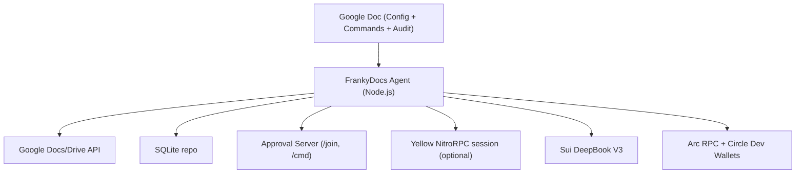

# FrankyDocs (DocWallet)

**HackMoney 2026** — Arc · Sui DeepBook · Yellow

One-line pitch: FrankyDocs turns a Google Doc into a multi-chain DeFi treasury. Proposers need no wallet; approvers sign once via MetaMask, WalletConnect, or Yellow delegated keys. Approvals can be gasless using Yellow delegated session keys.

Note: the codebase uses the internal name "DocWallet" in env vars, database schema, and template anchors (for example `DOCWALLET_*` and `docwallet.policy`).

## What it does
- Watches a Google Doc for commands in a Commands table
- Parses `DW ...` commands and enforces policy from ENS text records
- Collects approvals via a local web server and signer registry
- Auto-proposes missing setup steps (policy or session) when enabled
- Shows approval progress and gasless impact metrics
- Executes on Sui DeepBook and Arc (Circle dev-controlled wallets or direct RPC)
- Writes results back into the same Google Doc (Commands, Audit Log, Recent Activity)
- Chat suggestions are non-executing; use `!execute` in Chat to insert a command row

## Architecture

## Quick demo (2 to 3 minutes)
1. Configure environment (see `docs/execution-plan.md`) and run `npm run dev`.
2. Create a Google Doc named `[DocWallet] <Your Treasury Name>` and share it with the service account.
3. In the Commands table:
   - `DW /setup`
   - Open the join URL, add two signers
   - `DW QUORUM 2`
4. Optional Yellow flow:
   - `DW SESSION_CREATE`
5. Run a payment and approve:
   - `DW PAYOUT 1 USDC TO 0x0000000000000000000000000000000000000001`
6. Run a trade and approve:
   - `DW LIMIT_BUY SUI 5 USDC @ 1.02`
7. Open the approval page to show quorum progress and gasless metrics.
8. Show the Audit Log and Recent Activity rows updating.

## Docs
- `docs/project-explanation.md`
- `docs/commands.md`
- `docs/execution-plan.md`
- `docs/demo-script.md`
- `docs/how-to-maximize-winning.md` — HackMoney 2026 checklist
- `docs/submission-one-pager.md` — copy-paste for submission form

## Roadmap (high level)
- Richer risk engine with portfolio heuristics
- More chains and trading pairs
- Sponsored transactions and passkey approvals

## Development
- Node.js 20+
- Install: `npm install`
- Run: `npm run dev`
- Sanity check: `npm run doctor`
- Tests: `npm run test`

## Judge / hackathon setup (quick)
1. Copy `.env.example` to `.env` and set `GOOGLE_SERVICE_ACCOUNT_JSON`, `DOCWALLET_MASTER_KEY`; add Arc/Sui/Circle keys if you want full flows.
2. `npm install && npm run dev`
3. Create a Google Doc titled `[DocWallet] <name>`, share it with the service account email (Editor).
4. Wait for the template to appear, then run `DW /setup` in the Commands table. See `docs/execution-plan.md` and `docs/demo-script.md` for the full flow.
