# FrankyDocs (DocWallet)

**HackMoney 2026** — Yellow · Arc · Sui DeepBook

> Turn any Google Doc into a multi-chain DeFi treasury. Proposers need no wallet; approvers sign once via Yellow delegated keys (gasless). The autonomous agent monitors prices, executes stop-losses, sweeps yield, and rebalances capital across Arc, Sui, and Yellow — all from a Google Doc.

Note: the codebase uses the internal name "DocWallet" in env vars, database schema, and template anchors (for example `DOCWALLET_*`).

---

## Table of Contents

1. [Prize Track Alignment](#-prize-track-alignment)
2. [Architecture](#architecture)
3. [How It Works](#how-it-works)
4. [All 35 Commands — Complete Reference](#-all-35-commands--complete-reference)
5. [Integration Deep Dives](#-integration-deep-dives)
6. [Autonomous Agent Behaviors](#-autonomous-agent-behaviors)
7. [Unified Treasury & Cross-Chain Rebalance](#-unified-treasury--cross-chain-rebalance)
9. [Dashboard & Web UI](#️-dashboard--web-ui)
10. [Database Schema](#️-database-schema)
11. [NLP Auto-Detect (Natural Language)](#️-nlp-auto-detect-natural-language)
12. [Configuration Reference](#️-configuration-reference)
13. [Google Docs Integration](#-google-docs-integration)
14. [Wallet & Key Management](#-wallet--key-management)
15. [Test Suite](#-test-suite)
16. [Quick Demo Script](#-quick-demo-script-23-minutes)
17. [Development & Setup](#️-development--setup)
18. [Project Structure](#-project-structure)
19. [Tech Stack & Dependencies](#-tech-stack--dependencies)
20. [Roadmap](#roadmap)

---

## 🌟 Track Alignment

### Yellow Network — State Channel Integration
- **NitroRPC/0.4 protocol** — real WebSocket + HTTP transport with ECDSA signing (`secp256k1` + `keccak256`)
- **Delegated session keys** — signers authorize once via EIP-712, then approve commands gaslessly
- **Off-chain ytest.usd payments** — `DW YELLOW_SEND 5 USDC TO 0x...` redistributes allocations without gas
- **Session lifecycle** — `SESSION_CREATE` → off-chain operations → `SESSION_CLOSE` (on-chain settlement)
- **Gasless approvals** — every command approval is recorded via `submit_app_state` instead of on-chain tx
- **Yellow asset** — configurable via `YELLOW_ASSET` env var (defaults to `ytest.usd`)
- **NitroRPC methods**: `create_app_session`, `submit_app_state`, `submit_off_chain_payment`, `close_app_session`
- **Quorum multi-sig** — multiple signer signatures in `sig` array for multi-party methods

### Arc + Circle — Cross-Chain Treasury
- **Arc L1 testnet** (chain ID `5042002`) — all EVM treasury operations execute on Arc
- **Circle Developer-Controlled Wallets SDK v2** — creates wallets, resolves USDC token UUIDs, executes transactions
- **CCTP Bridge** — `DW BRIDGE 100 USDC FROM arc TO sui` with Circle cross-chain routing (7-chain mapping)
- **Unified Treasury** — `DW TREASURY` shows combined balances across Sui, Arc, and Yellow with USD valuation
- **Cross-chain Rebalance** — `DW REBALANCE 100 FROM arc TO sui` moves capital between all 3 chains (6 routes)
- **Autonomous agent** — monitors balances, detects idle capital, auto-proposes `SWEEP_YIELD` and `REBALANCE`
- **Multi-recipient payouts** — `DW PAYOUT_SPLIT` distributes USDC to multiple addresses in one flow
- **Circle CCTP chains**: Arc-Testnet, ETH-Sepolia, MATIC-Amoy, AVAX-Fuji, SOL-Devnet, SUI-Testnet
- **ERC-20 USDC** — 6 decimal precision on Arc (address: `0x3600...`)

### Sui / DeepBook V3  — CLOB Trading
- **Official `@mysten/deepbook-v3` SDK** with Programmable Transaction Blocks (PTB)
- **Full order lifecycle** — limit orders, market orders (IOC), cancel, settle, deposit, withdraw
- **BalanceManager** — on-chain shared balance for capital-efficient trading
- **Price Oracle** — live SUI/USDC from DeepBook orderbook L2 data (bid/ask/mid/spread)
- **Conditional orders** — stop-loss & take-profit auto-trigger from price ticks
- **P&L tracking** — trade history with running profit/loss calculations
- **Gas checking** — validates Sui gas balance before submitting transactions
- **Coin merging** — PTB-based coin merging for deposits

---

## Architecture

```mermaid
flowchart TB
  Doc["Google Doc<br/>(Config + Commands + Audit Log + Balances + Chat)"] --> Agent["FrankyDocs Agent<br/>(Node.js / TypeScript)"]
  Agent --> DocsAPI["Google Docs API<br/>+ Drive API"]
  Agent --> DB["SQLite Database<br/>(WAL mode)"]
  Agent --> Server["HTTP Server :8787<br/>(Dashboard + Approval UI)"]
  Agent --> Yellow["Yellow NitroRPC/0.4<br/>(State Channels · ytest.usd)"]
  Agent --> DeepBook["DeepBook V3<br/>(Sui CLOB · SUI/USDC)"]
  Agent --> Arc["Arc L1 Testnet<br/>(EVM · Chain 5042002)"]
  Agent --> Circle["Circle Dev Wallets<br/>(CCTP Bridge · USDC)"]
  Agent --> WC["WalletConnect v2<br/>(dApp Gateway)"]
```



### Treasury Flow Diagram

```
  ┌─────────────┐       ┌─────────────┐       ┌─────────────┐
  │   Yellow     │  ⇄    │    Arc      │  ⇄    │    Sui      │
  │  ytest.usd   │       │  USDC(ERC20)│       │ SUI + DBUSDC│
  │  Off-chain   │       │ Circle CCTP │       │ DeepBook V3 │
  │  Gasless     │       │ Chain 5042002│      │ CLOB Trading│
  └─────────────┘       └─────────────┘       └─────────────┘
         ↕                     ↕                      ↕
       YELLOW_SEND         PAYOUT/BRIDGE         LIMIT/MARKET
       SESSION_CREATE      CCTP cross-chain      STOP_LOSS/TP
       submit_off_chain    Circle Dev Wallets    BalanceManager
```

`DW TREASURY` — View all balances | `DW REBALANCE <amt> FROM <chain> TO <chain>` — Move capital

---

## How It Works

1. **Proposers** type `DW <command>` in a Google Doc — no wallet needed
2. **Agent** discovers the Doc, parses commands, validates quorum
3. **Approvers** sign via MetaMask on the web UI → approval stored on Yellow state channel (gasless)
4. **Quorum met** → Agent auto-executes the command on the target chain
5. **Results** written back to the Google Doc (Commands table, Audit Log, Recent Activity)

### Roles
| Role | Wallet Required? | What They Do |
|------|:-:|---|
| Proposer | ❌ No | Types commands into the Google Doc |
| Approver / Signer | ✅ Yes (MetaMask) | Signs once to create Yellow session key, then approves gaslessly |
| Agent | ⚙️ Auto | Monitors doc, enforces policy, executes, proposes safety orders |

---

## 📋 All 35 Commands — Complete Reference

### Setup & Administration
| Command | Syntax | Description |
|---------|--------|-------------|
| **SETUP** | `DW /setup` or `DW SETUP` | Creates EVM wallet (Arc), Sui wallet, and Circle developer-controlled wallet |
| **STATUS** | `DW STATUS` | Shows current wallet addresses, balances, signer list, quorum, and integration status |
| **QUORUM** | `DW QUORUM <n>` | Sets approval quorum (number of signer approvals required to execute) |
| **SIGNER_ADD** | `DW SIGNER_ADD 0x... WEIGHT <n>` | Adds a signer with specified voting weight |

### Yellow Network — State Channels
| Command | Syntax | Description |
|---------|--------|-------------|
| **SESSION_CREATE** | `DW SESSION_CREATE` | Opens NitroRPC state channel with USDC/ytest.usd allocations |
| **SESSION_STATUS** | `DW SESSION_STATUS` | Shows Yellow session state, version, allocations |
| **SESSION_CLOSE** | `DW SESSION_CLOSE` | Closes the NitroRPC state channel (triggers on-chain settlement) |
| **YELLOW_SEND** | `DW YELLOW_SEND 5 USDC TO 0x...` | Instant off-chain payment via state channel (accepts USDC, ytest.usd, or USD) |

### DeepBook V3 Trading (Sui)
| Command | Syntax | Description |
|---------|--------|-------------|
| **LIMIT_BUY** | `DW LIMIT_BUY SUI 50 USDC @ 1.02` | Places a limit buy order on DeepBook |
| **LIMIT_SELL** | `DW LIMIT_SELL SUI 50 USDC @ 1.50` | Places a limit sell order on DeepBook |
| **MARKET_BUY** | `DW MARKET_BUY SUI 10` | Executes immediate-or-cancel buy at market price |
| **MARKET_SELL** | `DW MARKET_SELL SUI 10` | Executes immediate-or-cancel sell at market price |
| **CANCEL** | `DW CANCEL <orderId>` | Cancels an open DeepBook limit order |
| **CANCEL_ORDER** | `DW CANCEL_ORDER <orderId>` | Cancels a conditional order (stop-loss or take-profit) |
| **SETTLE** | `DW SETTLE` | Settles all completed DeepBook trades |
| **DEPOSIT** | `DW DEPOSIT SUI 10` | Deposits coins into DeepBook BalanceManager |
| **WITHDRAW** | `DW WITHDRAW USDC 50` | Withdraws coins from DeepBook BalanceManager |
| **PRICE** | `DW PRICE` | Shows live SUI/USDC price from DeepBook orderbook (bid/ask/mid/spread) |
| **TRADE_HISTORY** | `DW TRADE_HISTORY` | Shows all trades with P&L tracking |

### Conditional Orders
| Command | Syntax | Description |
|---------|--------|-------------|
| **STOP_LOSS** | `DW STOP_LOSS SUI 100 @ 0.80` | Auto-sells when price drops to trigger price |
| **TAKE_PROFIT** | `DW TAKE_PROFIT SUI 100 @ 2.50` | Auto-sells when price reaches target |

### Treasury & Payouts (Arc + Circle)
| Command | Syntax | Description |
|---------|--------|-------------|
| **PAYOUT** | `DW PAYOUT 10 USDC TO 0x...` | Sends USDC via Circle developer-controlled wallet |
| **PAYOUT_SPLIT** | `DW PAYOUT_SPLIT 100 USDC TO 0xA:50,0xB:30,0xC:20` | Multi-recipient payout (percentages must sum to 100) |
| **BRIDGE** | `DW BRIDGE 100 USDC FROM arc TO sui` | Cross-chain USDC transfer via Circle CCTP |
| **TREASURY** | `DW TREASURY` | Unified cross-chain balance view (Sui + Arc + Yellow) with USD valuation and distribution % |
| **REBALANCE** | `DW REBALANCE 100 FROM arc TO sui` | Moves capital between chains (6 routes: arc⇄sui⇄yellow) |
| **SWEEP_YIELD** | `DW SWEEP_YIELD` | Settles DeepBook orders, reports idle capital across all chains including Yellow |

### WalletConnect v2
| Command | Syntax | Description |
|---------|--------|-------------|
| **CONNECT** | `DW CONNECT wc:...` | Pairs with a dApp via WalletConnect URI |
| **WC_TX** | `DW TX {"chainId":5042002,"to":"0x...","data":"0x..."}` | Executes a WalletConnect transaction request |
| **WC_SIGN** | `DW SIGN {"address":"0x...","message":"..."}` | Signs a message via WalletConnect |

### Scheduling & Automation
| Command | Syntax | Description |
|---------|--------|-------------|
| **SCHEDULE** | `DW SCHEDULE EVERY 4h: LIMIT_BUY SUI 2 USDC @ 999999` | DCA / recurring command execution |
| **CANCEL_SCHEDULE** | `DW CANCEL_SCHEDULE sched_...` | Cancels an active schedule |
| **AUTO_REBALANCE** | `DW AUTO_REBALANCE ON` | Enables agent auto-proposals (sweeps, stop-losses, rebalances) |
| **ALERT_THRESHOLD** | `DW ALERT USDC BELOW 500` | Sets balance threshold alert |

---

## 🔌 Integration Deep Dives

### 1. Yellow Network — NitroRPC/0.4

**File**: `src/integrations/yellow.ts` (403 lines)

| Feature | Detail |
|---------|--------|
| Protocol | NitroRPC/0.4 — JSON-RPC over HTTP + WebSocket |
| Signing | `secp256k1` ECDSA over `keccak256(JSON.stringify(req))` |
| Methods | `create_app_session`, `submit_app_state`, `submit_off_chain_payment`, `close_app_session` |
| Session Keys | EIP-712 delegated keys — sign once, approve gaslessly forever |
| Asset | `ytest.usd` (configurable via `YELLOW_ASSET`) |
| Multi-party | Multiple `sig` entries for quorum signing |
| Allocations | Tracks per-participant balances in the state channel |

**Flow**: Join URL → MetaMask signature → Session key created → All future approvals gasless via `submit_app_state`

### 2. Arc L1 — EVM (Chain 5042002)

**File**: `src/integrations/arc.ts` (140 lines)

| Feature | Detail |
|---------|--------|
| Chain | Arc Testnet, ID `5042002` |
| RPC | `https://rpc.testnet.arc.network` (configurable) |
| Client | `viem` (`createPublicClient` + `createWalletClient`) |
| USDC | ERC-20, 6 decimals, address `0x3600000000000000000000000000000000000000` |
| Methods | `transferUsdc()`, `sendTransaction()`, `signMessage()`, `getBalances()` |
| Gas | EIP-1559 (maxFeePerGas + maxPriorityFeePerGas) |

### 3. Circle Developer-Controlled Wallets — CCTP

**File**: `src/integrations/circle.ts` (239 lines)

| Feature | Detail |
|---------|--------|
| SDK | `@circle-fin/developer-controlled-wallets` v2 |
| Wallet Types | EOA or SCA (Smart Contract Account) |
| Token Resolution | Resolves USDC token UUID from wallet balance list |
| CCTP Bridge | Burns USDC on source, mints on destination (atomic settlement) |
| Chain Mapping | `arc`→ARC-TESTNET, `eth`→ETH-SEPOLIA, `polygon`→MATIC-AMOY, `avax`→AVAX-FUJI, `sol`→SOL-DEVNET, `sui`→SUI-TESTNET |
| Bridge Timeout | 180s (extended for cross-chain attestation) |
| Polling | 3s interval for transaction status |
| Methods | `ensureWalletSet()`, `createArcWallet()`, `payout()`, `bridgeUsdc()`, `getWalletBalance()` |

### 4. DeepBook V3 — Sui CLOB

**File**: `src/integrations/deepbook.ts` (526 lines)

| Feature | Detail |
|---------|--------|
| SDK | `@mysten/deepbook-v3` + `@mysten/sui` |
| Pool | SUI/DBUSDC (testnet) |
| Order Types | Limit (GTC), Market (IOC at extreme price) |
| PTB | Programmable Transaction Blocks for atomic execution |
| BalanceManager | On-chain shared balance object for capital efficiency |
| Price Oracle | `getMidPrice()` — bid, ask, mid, spread from L2 orderbook |
| Gas Check | `checkGas()` — validates minimum SUI for transactions |
| Deposit/Withdraw | PTB coin merging for deposits, direct withdraw to owner |

### 5. WalletConnect v2

**File**: `src/integrations/walletconnect.ts` (212 lines)

| Feature | Detail |
|---------|--------|
| SDK | `@walletconnect/web3wallet` + `@walletconnect/core` |
| Events | `session_proposal`, `session_request`, `session_delete`, `session_expire` |
| Methods | `pair()`, `respondToRequest()`, `approveSession()` |
| Storage | Sessions + requests persisted in SQLite |

---

## 🤖 Autonomous Agent Behaviors

The engine runs **8 concurrent tick loops**:

| Tick Loop | Interval | What It Does |
|-----------|----------|--------------|
| **discoveryTick** | 60s | Scans Google Drive for docs matching `[DocWallet]*` prefix |
| **pollTick** | 15s | Reads Commands table, parses new commands, syncs config from doc |
| **executorTick** | Continuous | Executes approved commands on target chains |
| **balancesTick** | 60s | Aggregates Sui (SUI + DBUSDC), Arc (Native + USDC), Circle USDC, Yellow ytest.usd; computes portfolio USD |
| **schedulerTick** | 30s | Fires scheduled commands when `next_run_at` reached |
| **chatTick** | 15s | Reads Chat table, responds with suggestions, `!execute` to insert command rows |
| **agentDecisionTick** | 60s | Spread volatility detection, portfolio imbalance, auto-proposals |
| **conditionalOrdersTick** | 15s | Monitors SUI/USDC price, triggers stop-loss and take-profit orders |

### Agent Auto-Proposals

When `AGENT_AUTOPROPOSE=1` in the doc config:

| Proposal | Trigger | Command Proposed |
|----------|---------|------------------|
| **Setup reminder** | No wallets created yet | `DW SETUP` |
| **Session create** | No Yellow session active | `DW SESSION_CREATE` |
| **Sweep yield** | Settled balance > $1 detected | `DW SWEEP_YIELD` |
| **Stop-loss** | Active buy orders without protection | `DW STOP_LOSS SUI <qty> @ <price>` |
| **Cross-chain rebalance** | One chain holds >80% of total USD | `DW REBALANCE <amt> FROM <chain> TO <chain>` |

---

##  Unified Treasury & Cross-Chain Rebalance

### TREASURY Command

`DW TREASURY` aggregates balances from all 3 chains:

```
╔══════════════════════════════════════════╗
║          UNIFIED TREASURY VIEW          ║
╠══════════╦═══════════╦══════════════════╣
║  Chain   ║  Balance  ║  Distribution    ║
╠══════════╬═══════════╬══════════════════╣
║  Sui     ║  150 SUI  ║  45.2%           ║
║          ║  50 DBUSDC║                  ║
║  Arc     ║  200 USDC ║  38.1%           ║
║  Yellow  ║  88 ytest ║  16.7%           ║
╠══════════╬═══════════╬══════════════════╣
║  TOTAL   ║  $526 USD ║  100%            ║
╚══════════╩═══════════╩══════════════════╝
```

### REBALANCE Command — 6 Routes

| Route | Mechanism |
|-------|-----------|
| `arc → sui` | Circle CCTP bridge (USDC burn/mint) |
| `sui → arc` | Circle CCTP bridge |
| `arc → yellow` | Yellow `submit_off_chain_payment` |
| `yellow → arc` | Yellow `submit_off_chain_payment` |
| `sui → yellow` | Yellow `submit_off_chain_payment` |
| `yellow → sui` | Yellow `submit_off_chain_payment` |

Agent auto-proposes rebalance when any single chain holds >80% of total USD portfolio.

---

## 🖥️ Dashboard & Web UI

**Port**: `8787` (configurable via `HTTP_PORT`)

### Pages & Endpoints

| Route | Description |
|-------|-------------|
| `GET /` | **Dashboard** — Doc cards, integration status cards (Yellow, Arc+Circle, DeepBook), treasury flow diagram, "How It Works" section |
| `GET /join/:docId` | **Join page** — MetaMask connect → create Yellow session key (gasless) |
| `GET /signers/:docId` | **Signers page** — list all registered signers with weights |
| `GET /activity/:docId` | **Activity page** — agent activity log |
| `GET /sessions/:docId` | **Sessions page** — Yellow session info |
| `GET /approve/:docId/:cmdId` | **Approval page** — sign to approve/reject command |
| `POST /cmd/:docId` | **API: Submit command** — creates command row in doc |
| `GET /api/docs` | **API: List docs** — full integration status (Yellow, Circle, signers, trades, etc.) |
| `POST /api/approve` | **API: Submit approval** — JSON body with signature |
| `POST /yellow-join/:docId` | **API: Yellow join flow** — session key creation |
| `POST /yellow-complete/:docId` | **API: Complete join** — finalize session key + signer registration |

### Dashboard Integration Cards

- **Yellow Network** — "State Channels · Off-chain gasless ytest.usd payments · NitroRPC/0.4"
- **Arc + Circle** — "USDC Treasury · Dev wallets + CCTP bridge · Chain 5042002"
- **Sui DeepBook V3** — "CLOB Trading · Limit, market, stop-loss · PTB Orders"

### Treasury Flow Diagram (in dashboard)

```
  Yellow (ytest.usd) ⇄ Arc (USDC ERC-20) ⇄ Sui (SUI + DBUSDC)
  Off-chain · Gasless    Circle CCTP · 5042002   DeepBook V3 · CLOB
```

---

## 🗄️ Database Schema

SQLite with WAL mode. **15 tables**:

| Table | Purpose |
|-------|---------|
| `docs` | Tracked Google Docs (doc_id, name, evm_address, sui_address) |
| `secrets` | AES-encrypted wallet private keys |
| `commands` | All parsed commands with status, tx digests, result/error text |
| `doc_settings` | Per-doc quorum settings |
| `signers` | Registered signers with voting weights |
| `command_approvals` | Approval/rejection decisions per signer per command |
| `yellow_sessions` | Yellow NitroRPC session state (app_session_id, version, allocations) |
| `yellow_session_keys` | Encrypted delegated session keys per signer |
| `circle_wallets` | Circle developer-controlled wallet info |
| `walletconnect_sessions` | WalletConnect v2 session persistence |
| `walletconnect_requests` | WalletConnect transaction/sign requests |
| `schedules` | Scheduled recurring commands (interval, next_run_at, total_runs) |
| `doc_config` | Per-doc configuration key-value store |
| `agent_activity` | Agent proposal and action log |
| `trades` | Trade history (side, qty, price, notional, fee, P&L) |
| `price_cache` | Cached prices (pair, mid, bid, ask, source) |
| `conditional_orders` | Active stop-loss and take-profit orders |

### Command Status State Machine

```
INVALID ─── (bad parse)
   │
RAW → PENDING_APPROVAL → APPROVED → EXECUTING → EXECUTED
                │                        │
                └→ REJECTED              └→ FAILED
```

---

## 🗣️ NLP Auto-Detect (Natural Language)

Commands can be typed without the `DW` prefix. The auto-detect engine understands:

| Natural Language | Detected As |
|-----------------|-------------|
| `buy 50 SUI at 1.02` | `DW LIMIT_BUY SUI 50 USDC @ 1.02` |
| `sell 50 SUI @ 1.5` | `DW LIMIT_SELL SUI 50 USDC @ 1.5` |
| `send 10 USDC to 0x...` | `DW PAYOUT 10 USDC TO 0x...` |
| `pay 10 USDC to 0x...` | `DW PAYOUT 10 USDC TO 0x...` |
| `transfer 10 USDC to 0x...` | `DW PAYOUT 10 USDC TO 0x...` |
| `bridge 100 USDC from arc to sui` | `DW BRIDGE 100 USDC FROM arc TO sui` |
| `deposit 10 SUI` | `DW DEPOSIT SUI 10` |
| `withdraw 10 SUI` | `DW WITHDRAW SUI 10` |
| `market buy 10 SUI` | `DW MARKET_BUY SUI 10` |
| `market sell 5 SUI` | `DW MARKET_SELL SUI 5` |
| `setup` or `/setup` | `DW /setup` |
| `settle` | `DW SETTLE` |
| `status` | `DW STATUS` |
| `cancel <id>` | `DW CANCEL <id>` |
| `cancel schedule sched_...` | `DW CANCEL_SCHEDULE sched_...` |
| `stop loss 100 SUI at 0.80` | `DW STOP_LOSS SUI 100 @ 0.80` |
| `take profit 100 SUI at 2.50` | `DW TAKE_PROFIT SUI 100 @ 2.50` |
| `tp SUI 100 @ 2.50` | `DW TAKE_PROFIT SUI 100 @ 2.50` |
| `sweep` / `sweep yield` / `collect` | `DW SWEEP_YIELD` |
| `trades` / `pnl` / `p&l` | `DW TRADE_HISTORY` |
| `price` / `prices` | `DW PRICE` |
| `cancel order ord_...` | `DW CANCEL_ORDER ord_...` |
| `treasury` / `all balances` | `DW TREASURY` |
| `rebalance 100 from arc to sui` | `DW REBALANCE 100 FROM arc TO sui` |
| `wc:...` (pasted URI) | `DW CONNECT wc:...` |

---

## ⚙️ Configuration Reference

All config via environment variables (`.env`), validated with **Zod**:

### Required
| Variable | Description |
|----------|-------------|
| `GOOGLE_SERVICE_ACCOUNT_JSON` | Google service account credentials JSON |
| `DOCWALLET_MASTER_KEY` | AES master key for encrypting wallet private keys |

### Server
| Variable | Default | Description |
|----------|---------|-------------|
| `HTTP_PORT` | `8787` | HTTP server port |
| `PUBLIC_BASE_URL` | `http://localhost:8787` | Public URL for join/approval links |

### Document Discovery
| Variable | Default | Description |
|----------|---------|-------------|
| `DOCWALLET_DOC_ID` | — | Pin to a single doc (skip discovery) |
| `DOCWALLET_DISCOVER_ALL` | `0` | Discover all shared docs (not just prefixed) |
| `DOCWALLET_NAME_PREFIX` | `[DocWallet]` | Doc name prefix filter for discovery |

### Polling Intervals
| Variable | Default | Description |
|----------|---------|-------------|
| `POLL_INTERVAL_MS` | `15000` | Command polling interval |
| `DISCOVERY_INTERVAL_MS` | `60000` | Doc discovery interval |
| `BALANCE_POLL_INTERVAL_MS` | `60000` | Balance aggregation interval |
| `SCHEDULER_INTERVAL_MS` | `30000` | Schedule execution check interval |

### Sui / DeepBook
| Variable | Default | Description |
|----------|---------|-------------|
| `DEEPBOOK_ENABLED` | `0` | Enable DeepBook V3 integration |
| `SUI_RPC_URL` | — | Sui fullnode HTTP RPC URL (required when DeepBook enabled) |

### Arc / Circle
| Variable | Default | Description |
|----------|---------|-------------|
| `ARC_ENABLED` | `1` | Enable Arc L1 integration |
| `ARC_RPC_URL` | `https://rpc.testnet.arc.network` | Arc RPC endpoint |
| `ARC_USDC_ADDRESS` | `0x3600...0000` | USDC ERC-20 contract on Arc |
| `CIRCLE_ENABLED` | `0` | Enable Circle developer-controlled wallets |
| `CIRCLE_API_KEY` | — | Circle API key (required when enabled) |
| `CIRCLE_ENTITY_SECRET` | — | Circle entity secret (required when enabled) |
| `CIRCLE_WALLET_SET_ID` | — | Existing wallet set ID (auto-created if empty) |
| `CIRCLE_BLOCKCHAIN` | `ARC-TESTNET` | Circle blockchain identifier |
| `CIRCLE_ACCOUNT_TYPE` | `EOA` | Wallet account type (EOA or SCA) |

### Yellow Network
| Variable | Default | Description |
|----------|---------|-------------|
| `YELLOW_ENABLED` | `0` | Enable Yellow NitroRPC integration |
| `YELLOW_RPC_URL` | — | Yellow HTTP RPC endpoint (required when enabled) |
| `YELLOW_WS_URL` | — | Yellow WebSocket endpoint |
| `YELLOW_APP_NAME` | — | Application name for sessions |
| `YELLOW_ASSET` | `ytest.usd` | Asset identifier for state channel allocations |

### WalletConnect
| Variable | Default | Description |
|----------|---------|-------------|
| `WALLETCONNECT_ENABLED` | `0` | Enable WalletConnect v2 |
| `WALLETCONNECT_PROJECT_ID` | — | WalletConnect Cloud project ID (required when enabled) |
| `WALLETCONNECT_RELAY_URL` | — | Custom relay URL |

### Zod Cross-Field Validation
- `YELLOW_RPC_URL` required when `YELLOW_ENABLED=1`
- `SUI_RPC_URL` required when `DEEPBOOK_ENABLED=1`
- `CIRCLE_API_KEY` + `CIRCLE_ENTITY_SECRET` required when `CIRCLE_ENABLED=1`
- `WALLETCONNECT_PROJECT_ID` required when `WALLETCONNECT_ENABLED=1`

---

## 📄 Google Docs Integration

### Doc Template Tables

Each Google Doc contains these tables (auto-synced by the agent):

| Table | Purpose |
|-------|---------|
| **Config** | Key-value settings (DOC_ID, WEB_BASE_URL, QUORUM, DOC_CELL_APPROVALS, AGENT_AUTOPROPOSE, SIGNER_APPROVAL_GAS_PAID) |
| **Commands** | `DW <command>` rows with status, result, and approval tracking |
| **Balances** | Live cross-chain balances (Sui SUI, Sui DBUSDC, Arc Native, Arc USDC, Circle USDC, Yellow ytest.usd, Total USD) |
| **Audit Log** | Timestamped record of all executed commands and results |
| **Recent Activity** | Last N agent actions (proposals, executions, errors) |
| **Open Orders** | Active DeepBook limit orders and conditional orders |
| **Chat** | Conversational input → agent responds with command suggestions; `!execute` to insert |
| **Sessions** | Yellow session key info per signer |

### Google APIs Used
- **Google Docs API** — Read/write tables (paragraph + table element manipulation)
- **Google Drive API** — Discover docs shared with service account

---

## 🔐 Wallet & Key Management

| Component | Detail |
|-----------|--------|
| **Master Key** | `DOCWALLET_MASTER_KEY` — AES encryption key for all wallet secrets |
| **EVM Wallet** | Generated via `viem` (`privateKeyToAccount`) — used for Arc transactions |
| **Sui Wallet** | Generated via `@mysten/sui` keypair — used for DeepBook PTBs |
| **Circle Wallet** | Created via Circle SDK (`createWallets`) — developer-controlled, no private key needed |
| **Session Keys** | Yellow delegated keys — created per-signer during join flow, AES-encrypted in DB |
| **Storage** | Encrypted blobs in `secrets` table; decrypted in-memory only when needed |

Encryption: `AES-256-CBC` with the master key (via Node.js `crypto` module + `node-forge`).

---

## 🧪 Test Suite

**196 tests** across 8 test files — all passing ✅

| Test File | Tests | Coverage |
|-----------|:-----:|----------|
| `test/commands-full.test.ts` | 150 | All 35 command types + NLP auto-detect + edge cases |
| `test/commands.test.ts` | 6 | Core parsing fundamentals |
| `test/policy.test.ts` | 11 | Policy evaluation for all command types (including REBALANCE, BRIDGE, YELLOW_SEND) |
| `test/repo-metrics.test.ts` | 2 | Database metrics and trade stats |
| `test/state.test.ts` | 2 | Command status state machine transitions |
| `test/deepbook-route.test.ts` | — | DeepBook routing tests |
| `test/sui-faucet.test.ts` | — | Sui faucet integration tests |
| `test/one-phrase.test.ts` | — | One-phrase NLP tests |

### Running Tests

```bash
npm run test         # Single run (vitest)
npm run test:watch   # Watch mode
```

### What's Tested
- ✅ All 35 command parsers (valid + invalid inputs)
- ✅ NLP auto-detect for 20+ natural language patterns
- ✅ Policy evaluation: `maxNotionalUsdc`, `dailyLimitUsdc`, `maxSingleTxUsdc`, `allowedPairs`, `payoutAllowlist`, `denyCommands`, `bridgeAllowed`, `allowedChains`, `schedulingAllowed`
- ✅ YELLOW_SEND accepts USDC, ytest.usd, and USD
- ✅ REBALANCE valid routes (arc/sui/yellow) and invalid chain rejection
- ✅ PAYOUT_SPLIT percentage validation (must sum to 100)
- ✅ SCHEDULE inner command validation (no nested schedules)
- ✅ BRIDGE chain validation (arc, sui, ethereum, arbitrum, polygon)
- ✅ State machine transitions (PENDING_APPROVAL → APPROVED → EXECUTING → EXECUTED/FAILED)

### 1. Setup
```bash
# Configure .env (see Configuration Reference above)
npm install && npm run dev
```

## 🛠️ Development & Setup

### Prerequisites
- Node.js 20+
- Google Cloud service account with Docs + Drive API enabled
- (Optional) Circle API key, Yellow testnet access, Sui RPC

### Install & Run

```bash
npm install          # Install dependencies
npm run dev          # Start with tsx (hot-reload)
npm run build        # TypeScript compilation
npm start            # Run compiled JS
npm run doctor       # Sanity check (validates env, APIs, integrations)
npm run test         # Run test suite (vitest)
```

### Judge / Hackathon Setup (Quick)

1. Copy `.env.example` to `.env` and set `GOOGLE_SERVICE_ACCOUNT_JSON`, `DOCWALLET_MASTER_KEY`; add Arc/Sui/Circle/Yellow keys if you want full flows.
2. `npm install && npm run dev`
3. Create a Google Doc titled `[FrankyDocs] <name>`, share it with the service account email (Editor).

---

## 📁 Project Structure

```
FrankyDocs/
├── src/
│   ├── index.ts                 # Entry point — loads config, creates clients, starts engine + server
│   ├── config.ts                # Zod-validated environment config (30+ vars)
│   ├── engine.ts                # Core engine — 8 tick loops, 36 command handlers, agent AI (2522 lines)
│   ├── server.ts                # HTTP server — dashboard, join/approval UI, API endpoints (1506 lines)
│   ├── core/
│   │   ├── commands.ts          # 35 command parsers + NLP auto-detect (702 lines)
│   │   ├── policy.ts            # Policy evaluation for all command types (180 lines)
│   │   └── state.ts             # Command status state machine
│   ├── db/
│   │   ├── schema.ts            # SQLite schema — 15 tables, WAL mode (207 lines)
│   │   └── repo.ts              # Database repository (881 lines)
│   ├── google/
│   │   ├── auth.ts              # Google service account authentication
│   │   ├── clients.ts           # Google API client initialization
│   │   ├── docs.ts              # Google Docs API helpers
│   │   ├── docwallet.ts         # Doc table manipulation (balances, commands, config, audit)
│   │   ├── drive.ts             # Google Drive API (doc discovery)
│   │   └── template.ts          # Doc template creation
│   ├── integrations/
│   │   ├── arc.ts               # Arc L1 EVM client (140 lines)
│   │   ├── circle.ts            # Circle developer-controlled wallets + CCTP (239 lines)
│   │   ├── deepbook.ts          # DeepBook V3 Sui CLOB client (526 lines)
│   │   ├── walletconnect.ts     # WalletConnect v2 service (212 lines)
│   │   └── yellow.ts            # Yellow NitroRPC/0.4 client (403 lines)
│   ├── tools/
│   │   └── doctor.ts            # Diagnostic tool (validates env + APIs)
│   ├── types/
│   │   ├── better-sqlite3.d.ts  # Type declarations
│   │   └── websocket.d.ts       # WebSocket type declarations
│   ├── util/
│   │   ├── hash.ts              # SHA-256 hashing utility
│   │   └── sleep.ts             # Async sleep helper
│   └── wallet/
│       ├── crypto.ts            # AES encryption/decryption with master key
│       ├── evm.ts               # EVM wallet generation (viem)
│       ├── store.ts             # Wallet secret storage (encrypt + persist)
│       └── sui.ts               # Sui wallet generation (@mysten/sui)
├── test/
│   ├── commands-full.test.ts    # 153 tests — all commands + NLP
│   ├── commands.test.ts         # 6 tests — core parsing
│   ├── policy.test.ts           # 11 tests — policy evaluation
│   ├── repo-metrics.test.ts     # 2 tests — database metrics
│   └── state.test.ts            # 2 tests — state machine
├── data/                        # Runtime data (SQLite DB, recovery files)
├── scripts/
│   ├── fund-wallet.js           # Utility to fund test wallets
│   └── test-template.ts         # Template testing script
├── plans/                       # Strategy and execution plan docs
├── package.json
├── tsconfig.json
├── tsconfig.build.json
└── vitest.config.ts
```

---

## 📦 Tech Stack & Dependencies

### Runtime Dependencies

| Package | Version | Purpose |
|---------|---------|---------|
| `googleapis` | ^140.0.0 | Google Docs + Drive API |
| `viem` | ^2.21.30 | EVM wallets, signing, Arc transactions |
| `@mysten/sui` | ^1.28.0 | Sui blockchain client |
| `@mysten/deepbook-v3` | ^0.16.1 | DeepBook V3 CLOB SDK |
| `@circle-fin/developer-controlled-wallets` | ^2.0.0 | Circle wallet + CCTP bridge SDK |
| `@walletconnect/web3wallet` | ^1.10.4 | WalletConnect v2 |
| `@walletconnect/core` | ^2.13.3 | WalletConnect core |
| `@walletconnect/utils` | ^2.13.3 | WalletConnect utilities |
| `better-sqlite3` | ^11.5.0 | SQLite database (WAL mode) |
| `zod` | ^3.24.1 | Runtime schema validation |
| `dotenv` | ^16.4.5 | Environment variable loading |
| `node-forge` | ^1.3.3 | Circle entity secret encryption |

### Dev Dependencies

| Package | Version | Purpose |
|---------|---------|---------|
| `typescript` | ^5.6.3 | TypeScript compiler |
| `tsx` | ^4.19.2 | TypeScript execution (dev mode) |
| `vitest` | ^2.1.8 | Test runner |
| `@types/node` | ^22.10.7 | Node.js type definitions |

---

## Roadmap

- Richer risk engine with portfolio heuristics
- More chains and trading pairs (multi-pool DeepBook)
- Sponsored transactions and passkey approvals
- Mobile-friendly approval UI
- Multi-doc portfolio aggregation
- Advanced order types (TWAP, iceberg)

---

## License

Built for **HackMoney 2026** hackathon.

---

<p align="center">
  <b>FrankyDocs</b> — Your Google Doc is your treasury.<br/>
  <sub>Type commands. Approve gaslessly. Trade across chains. All from a Doc.</sub>
</p>
