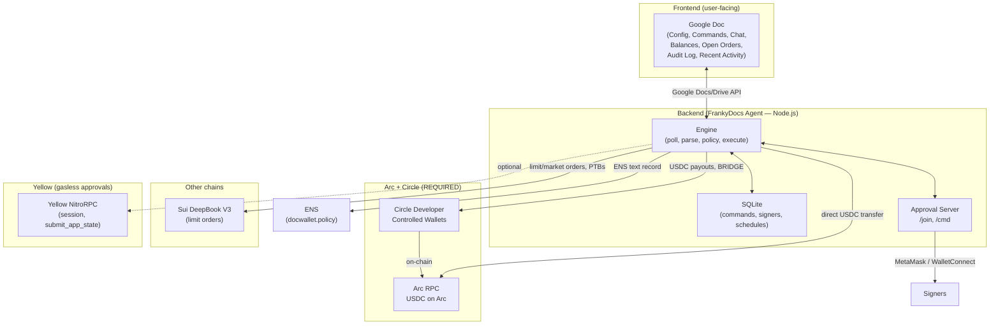

# FrankyDocs — Architecture (for submission)

Required by Arc bounties: **working frontend and backend plus an architecture diagram.** Below is the diagram; the Doc is the frontend, the Node agent is the backend.

---

## High-level architecture

---

## Arc / Circle data flow (for bounty submission)

- **Arc + USDC:** All USDC payouts and Circle wallet operations use **Arc** as the chain and **Circle developer-controlled wallets** for custody and transfers.
- **Multi-chain:** Same Doc triggers **Sui** (DeepBook) and **Arc** (USDC); **BRIDGE** moves USDC across chains (Circle transfer semantics).
- **Frontend:** Google Doc (Config, Commands, Chat, Balances, Open Orders, Audit Log, Recent Activity).
- **Backend:** Node.js agent (engine, SQLite, approval server); integrations: Arc RPC, Circle SDK, Sui/DeepBook, Yellow NitroRPC, ENS.

---

## Diagram export for submission

To attach an image: render the mermaid above (e.g. in GitHub, or at [mermaid.live](https://mermaid.live)) and save as `architecture.png`. Link it in your submission or README.
